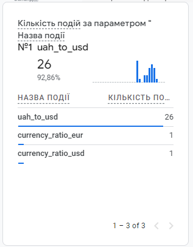

# Exchange Rate Tracker

This project is designed to track the exchange rate of the Ukrainian Hryvnia (UAH) to the US Dollar (USD) and send this
information to Google Analytics 4 using the Measurement Protocol.

## Requirements

To run this project, you will need:

- Node.js (version 14 or higher)
- npm (version 6 or higher)
- A Google Analytics 4 account
- Google service account credentials

## Setup

1. **Clone the repository**

   ```bash
   git clone https://github.com/Ruryk/HSA_Monitoring-systems-for-user-metrics.git
   cd HSA_Monitoring-systems-for-user-metrics

2. **Install dependencies**
   ```bash
   npm install

3. **Configure environment variables**
   ```plaintext
   MEASUREMENT_ID=your_measurement_id
   API_SECRET=your_api_secret
   PORT=3000

4. **Place your service account credentials**


5. **Running the Project**
    ```bash
   nodemon app.js

The server will start and begin tracking the USD/UAH exchange rate, sending data to Google Analytics every 1 hour.

### Project Structure:
- app.js: The main file that starts the server and sets up periodic data sending.
- config.js: The file for reading configuration from .env.
- routes/exchangeRate.js: The function for tracking and sending the exchange rate.
- services/exchangeRate.js: The function for fetching the USD/UAH exchange rate.
- services/googleAnalytics.js: The function for sending data to Google Analytics.
- utils/logger.js: The function for logging messages.

